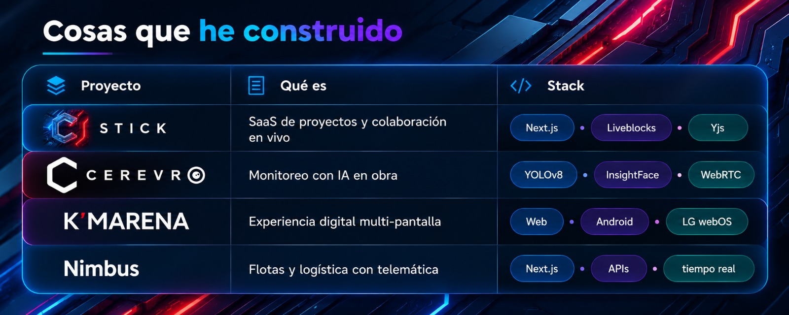

<p align="right"><b><a href="#es">ES</a></b> · <a href="#en">EN</a></p>

<a id="es"></a>

# Hola, soy Jorge Alfredo Jones

Tech Lead en **[Black Sheep Labs](https://blck-sheep.com)** · construyo productos que se sienten rápidos, claros y listos para crecer.

No solo “hago features”. Diseño arquitectura, lidero equipos y llevo SaaS, logística e IA de visión desde la idea hasta producción.

<p>
  <a href="https://alfredojones.dev"></a>
  <a href="https://www.linkedin.com/in/jorgeajones/"></a>
  <a href="https://stick.mx"></a>
  <a href="mailto:hola@alfredojones.dev"></a>
</p>

```ts
const jorge = {
  rol: "Tech Lead / Full-Stack",
  empresa: "Black Sheep Labs",
  enfoque: ["SaaS multi-tenant", "APIs", "logística", "visión artificial"],
  stack: ["Next.js", "React", "TypeScript", "Node.js"],
  modo: "de la idea → a producción",
};
```

---

### Ahora mismo
- **Black Sheep Labs** — lidero arquitecturas SaaS multi-tenant, colaboración en tiempo real y plataformas comerciales (COSMOS) + logística (Nimbus).
- **FYTTSA** — sistemas de visión artificial con YOLOv8, reconocimiento facial y streaming RTSP para monitoreo industrial.

### Antes
ECV (Android & Web) · PEMEX (becario Android)

---


<p align="center">
  <a href="https://stick.mx">
    
  </a>
</p>

---

### Caja de herramientas


---

### Formación

- **Ingeniería en Desarrollo de Videojuegos** — en curso (2023–)
- **Ingeniería en TIC’s** — 2015–2019

---

<details>
  <summary><b>GitHub stats</b></summary>
  <br />
  
  
</details>

<p align="center"><i>¿Construimos algo juntos?</i> → <a href="mailto:hola@alfredojones.dev">hola@alfredojones.dev</a> · <a href="#en">English ↓</a></p>

---

<a id="en"></a>
<p align="right"><a href="#es">ES</a> · <b><a href="#en">EN</a></b></p>

# Hey, I'm Jorge Alfredo Jones

Tech Lead at **[Black Sheep Labs](https://blck-sheep.com)** · I build products that feel fast, clear, and ready to scale.

I don't just ship tickets. I own architecture, lead teams, and take SaaS, logistics, and computer-vision systems from idea to production.

<p>
  <a href="https://alfredojones.dev"></a>
  <a href="https://www.linkedin.com/in/jorgeajones/"></a>
  <a href="https://stick.mx"></a>
  <a href="mailto:hola@alfredojones.dev"></a>
</p>

```ts
const jorge = {
  role: "Tech Lead / Full-Stack",
  company: "Black Sheep Labs",
  focus: ["multi-tenant SaaS", "APIs", "logistics", "computer vision"],
  stack: ["Next.js", "React", "TypeScript", "Node.js"],
  mode: "idea → production",
};
```

---

### Right now
- **Black Sheep Labs** — multi-tenant SaaS architecture, realtime collaboration, commercial platforms (COSMOS) + logistics (Nimbus).
- **FYTTSA** — computer-vision systems with YOLOv8, facial recognition, and RTSP streaming.

### Earlier
ECV (Android & Web) · PEMEX (Android intern)

---

### Things I've shipped

<p align="center">
  <a href="https://stick.mx">
    
  </a>
</p>

---

### Toolbox


---

### Education

- **Video Game Development Engineering** — in progress (2023–)
- **ICT Engineering** — 2015–2019

---

<details>
  <summary><b>GitHub stats</b></summary>
  <br />
  
  
</details>

<p align="center"><i>Let's build something.</i> → <a href="mailto:hola@alfredojones.dev">hola@alfredojones.dev</a> · <a href="#es">Español ↑</a></p>
